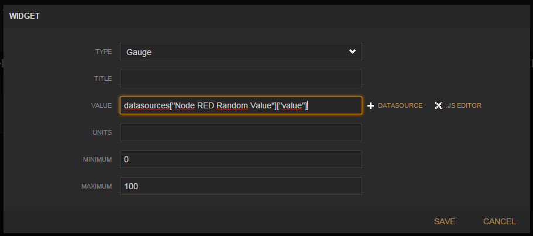
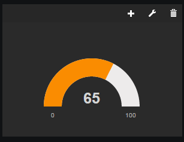

#Freeboard Dashboard for Node-RED

#Installation
Just install this plugin to your Node Red installation by using npm: "npm install node-red-contrib-freeboard" in your Node Red root directory

#Usage
Drag the freeboard node into your workspace and connect it appropriatley with some JSON emitting node.

```
[{"id":"176e3fcd.e891c","type":"freeboard","name":"[Node-RED] Freeboard","x":715,"y":233,"z":"681a559a.97e5ac","wires":[]},{"id":"41e8ab5f.be1754","type":"inject","name":"Send Random Value","topic":"","payload":"","payloadType":"date","repeat":"","crontab":"","once":false,"x":268,"y":233,"z":"681a559a.97e5ac","wires":[["c822ddf4.37dd2"]]},{"id":"c822ddf4.37dd2","type":"function","name":"","func":"msg.payload={value:Math.floor(Math.random()*100)};\nreturn msg;","outputs":1,"x":502,"y":233,"z":"681a559a.97e5ac","wires":[["176e3fcd.e891c"]]}]
```

Then go to your freeboard dashboard (is bundled with this node - no need to set up something; should run under /freeboard) and add the freeboard node from Node-RED as Datasource
Click "ADD" below "DATASOURCE"


Choose the Type that has the Name of your Node-RED node (in this case "[Node-RED] Freeboard") and give it a name that you want it to be available under in Freeboard.


Now you can add a Widget using the Datasource: Click on "ADD PANE" on the top left and in the new created pane on the "+" sign in the title

Choose the appropriate datasource. If Freeboard already received data from your node it will also offer you available properties - so best would be to hit the inject node within Node-RED at least once.

Thats it, here is your widget:



Don't forget to save your dashboard by hitting "SAVE FREEBOARD" on the top left.